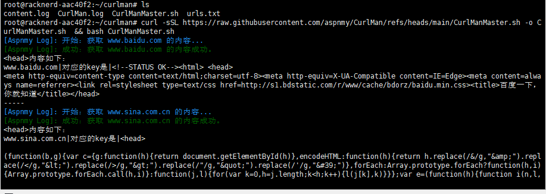

# CurlMan
Curl 批量拨测工具,能过正确返回被测域名的网站首页代码,如果约定了监控关键词,就可以正确识别所有权

## 使用说明

### 1、简单批量拨测：
- 首先将需要拨测的网站域名保存成urls.txt,结构如下
```
www.baidu.com
www.google.com
www.example.com
```

- 然后在你的服务器下运行下面这个代码,记得使用root权限,运行前确保已经安装了curl组件

```
curl -sSL https://raw.githubusercontent.com/aspnmy/CurlMan/refs/heads/main/CurlManMaster.sh -o CurlManMaster.sh  && bash CurlManMaster.sh
```

- 运行脚本后会保存一个content.log的文件,文件中能正确显示网站代码的为正确拨测
- 运行脚本后会保存一个CurlMan.log的文件,文件中能正确显示是否抓取网站成功



### 2、关键词批量拨测：
- 首先你先在自己的网站首页中插入一个约定的关键词,比如
```
<meta name=\"Aspnmy-CurlManMaster-Verification\" content=\"需要验证的code\" />
```
- 将以下代码添加到您的网站首页HTML代码的<head>标签与</head>标签之间,更新缓存以后

- 使用下面的脚本运行拨测脚本主体,生成一个运行脚本后会保存一个content.log的文件
```
curl -sSL https://raw.githubusercontent.com/aspnmy/CurlMan/refs/heads/main/CurlManMaster.sh -o CurlManMaster.sh  && bash CurlManMaster.sh
```
- 然后按下面的命令运行日志验证脚本(Verify_CurlManlogs.sh),会自动对日志中的关键词进行提取,生成一个验证的日志写入到CurlMan.log日志文件中
```
curl -sSL https://raw.githubusercontent.com/aspnmy/CurlMan/refs/heads/main/Verify_CurlManlogs.sh -o Verify_CurlManlogs.sh  && bash Verify_CurlManlogs.sh
```
CurlManMaster.sh重新更新content.log文件,由于不会覆盖记录原来的记录记得自己删除或者改写一下代码比如按照日期保存.
- 然后运行Verify_CurlManlogs.sh,这个脚本会自动搜索满足下方关键词条件的数据进行验证
- 如果验证的关键词较多,请生成一个Verification-Code.txt的文件,一个关键词一条,比如：(验证用的关键词尽量选择没用意义的随机字符串)
```
XCsd@sda!!
Xdsd@sd!TT
```
