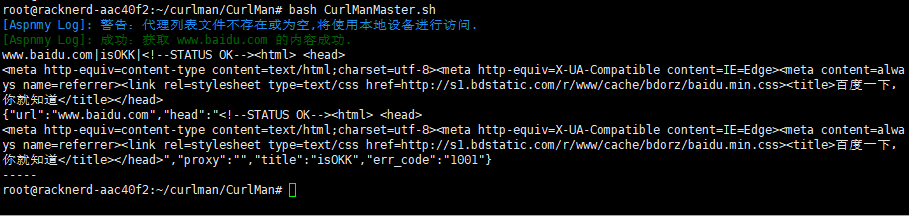
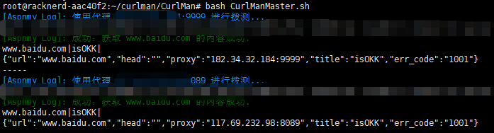
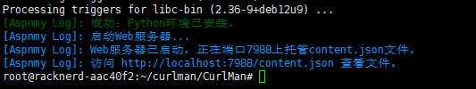
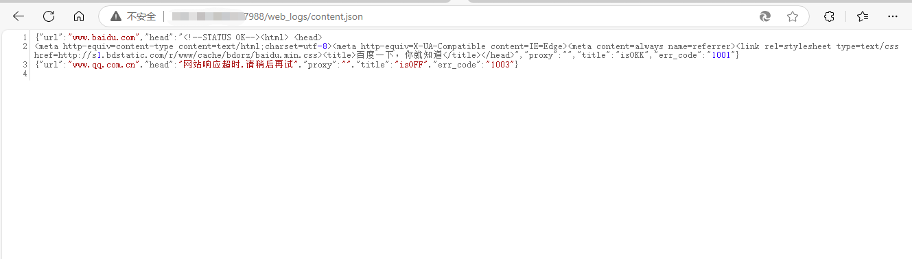

# CurlMan
Curl 批量拨测工具,能过正确返回被测域名的网站首页代码,如果约定了监控关键词,就可以正确识别所有权

## 使用说明

### 1.简单批量拨测(无代理模式)：
- 首先将需要拨测的网站域名保存成config/urls.txt,结构如下
```
www.baidu.com
www.google.com
www.example.com
```

- 然后在你的服务器下运行下面这个代码,记得使用root权限,运行前确保已经安装了curl组件

```
curl -sSL https://raw.githubusercontent.com/aspnmy/CurlMan/refs/heads/main/CurlManMaster.sh -o CurlManMaster.sh  && bash CurlManMaster.sh
```

- 运行脚本后会保存一个logs/content.log的文件,文件中能正确显示网站代码的为正确拨测
- 运行脚本后会保存一个logs/CurlMan.log的文件,文件中能正确显示是否抓取网站成功


### 2.简单批量拨测(有代理模式)：
- 首先将需要拨测的网站域名保存成config/urls.txt,结构如下
```
www.baidu.com
www.google.com
www.example.com
```
- 然后配置代理文件保存在config/proxies.txt下,一个代理地址一行
- 然后在你的服务器下运行下面这个代码,记得使用root权限,运行前确保已经安装了curl组件

```
curl -sSL https://raw.githubusercontent.com/aspnmy/CurlMan/refs/heads/main/CurlManMaster.sh -o CurlManMaster.sh  && bash CurlManMaster.sh
```

- 运行脚本后会保存一个logs/content.log的文件,文件中能正确显示网站代码的为正确拨测
- 运行脚本后会保存一个logs/CurlMan.log的文件,文件中能正确显示是否抓取网站成功


### 3.关键词批量拨测：
- 首先你先在自己的网站首页中插入一个约定的关键词,比如
```
<meta name=\"Aspnmy-CurlManMaster-Verification\" content=\"需要验证的code\" />
```
- 将以下代码添加到您的网站首页HTML代码的<head>标签与</head>标签之间,更新缓存以后

- 使用下面的脚本运行拨测脚本主体,生成一个运行脚本后会保存一个content.log的文件
```
curl -sSL https://raw.githubusercontent.com/aspnmy/CurlMan/refs/heads/main/CurlManMaster.sh -o CurlManMaster.sh  && bash CurlManMaster.sh
```
- 然后按下面的命令运行日志验证脚本(Verify_CurlManlogs.sh),会自动对日志中的关键词进行提取,生成一个验证的日志写入到logs/CurlMan.log日志文件中
```
curl -sSL https://raw.githubusercontent.com/aspnmy/CurlMan/refs/heads/main/Verify_CurlManlogs.sh -o Verify_CurlManlogs.sh  && bash Verify_CurlManlogs.sh
```
CurlManMaster.sh重新更新content.log文件,由于不会覆盖记录原来的记录记得自己删除或者改写一下代码比如按照日期保存.
- 然后运行Verify_CurlManlogs.sh,这个脚本会自动搜索满足下方关键词条件的数据进行验证
- 如果验证的关键词较多,请生成一个config/Verification-Code.txt的文件,一个关键词一条,比如：(验证用的关键词尽量选择没用意义的随机字符串)
```
XCsd@sda!!
Xdsd@sd!TT
```
### 4.使用WebUI的形式来查看拨测后的日志,为Api化使用组件做前置条件
- 1.先准备要拨测的域名列表文件urls.txt,保存在项目根目录的config/ 目录下
- 2.再使用CurlManMaster.sh运行一下生成web_logs/content.json和logs/content.log,logs/content.log用于在验证所有权模式下进行验证使用,web_logs/content.json用于网页访问日志文件使用,也是API使用拨测组件的基础前置条件
- 3.如果使用关键词验证模式的,再运行验证日志脚本Verify_CurlManlogs.sh来验证content.log日志中的关键字
- 4.运行runWebLogs.sh脚本运行一个独立的webserver(需要安装python全套环境,脚本自带组件检测和安装能力,如果安装失败,请手动安装)
- 5.然后浏览器运行http://IP:7988/web_logs/content.json 来访问日志文件
- 6.推荐仅在内网访问,如需使用外网访问,请用nginx规则进行文件托管
- 7.以宝塔面板为例子,把weblogs/ 整个目录设置成网站根目录,设置https证书即可访问拨测日志,使用宝塔的话请删除weblogs/web_serve.py文件保证安全性


### 5.使用APi模式进行拨测(更多,请访问Telegram群组进行咨询)
- 1.首先启动runWebLogs.sh,http://IP:7988/web_logs/content.json能正常访问
- 2.访问群组或者私库拉取Api管理器项目,会增加一个Api目录组件,并配置访问密钥,默认是随机8位字符24小时失效匿名服务
- 3.然后浏览器运行http://IP:7988/Api 正确则返回201错误码
- 4.构建APi功能,目前只支持post和put两种拨测形式,处于安全考虑get是禁止的.
- 5.APi拨测示例：
```
post http://IP:7988/Api -key xxxx-xxxxx -urls {"url1","url2"......"urln"} -ips {"ip1","ip2"......"ipn"}
```
- -key 内置的访问令牌
- -urls 需要拨测是域名列表
- -ips 需要使用的代理列表(使用-ips命令的时候,先要确认该ip具有代理权)
- 常见状态码说明:
- 1001 正确获得目标域名首页head标签
- 1002 目标域名可能被拦截了或者域名地址不正确
- 1003 目标域名访问超时，默认超时规则是30秒，正常30秒取不到数据访问肯定有问题了
- 1004 代理地址超时或异常，请更换代理节点
- 1005-1010 资费不足提示，为SVIP服务的保留号段

### 6.使用Telegram进行管理(更多,请访问Telegram群组进行咨询)
- 1.首先注册一个bot
- 2.git我们的go语言编译的跨平台Aspnmy_Telegram_bot开发框架
- 3.在Config中配置bot的key
- 4.在Aspnmy_Telegram_bot/主目录中,运行Aspnmy_Telegram_bot add CurlMan 新增一个机器人应用.会自动生成一个CurlMan的文件夹
- 5.进入CurlMan的文件夹,git本项目到本地git clone https://github.com/aspnmy/CurlMan.git
- 6.参考Aspnmy_Telegram_bot使用说明配置CurlMan.conf文件,主要是用于和主框架通讯的子服务Api入口的配置
- 7.将下面的代码保存成testApi.sh,并运行,正确返回拨测数据代表通讯正常

```
curl -sSL http://IP:7988/Api -key xxxx-xxxxx -urls {"url1","url2"......"urln"} -ips {"ip1","ip2"......"ipn"}
```

- 8.使用```Aspnmy_Telegram_bot start```运行机器人框架就可以和Telegram通讯了.
- 9.更多Telegram插件的问题请访问群组:https://t.me/+BqvlH6BDOWE3NjQ1